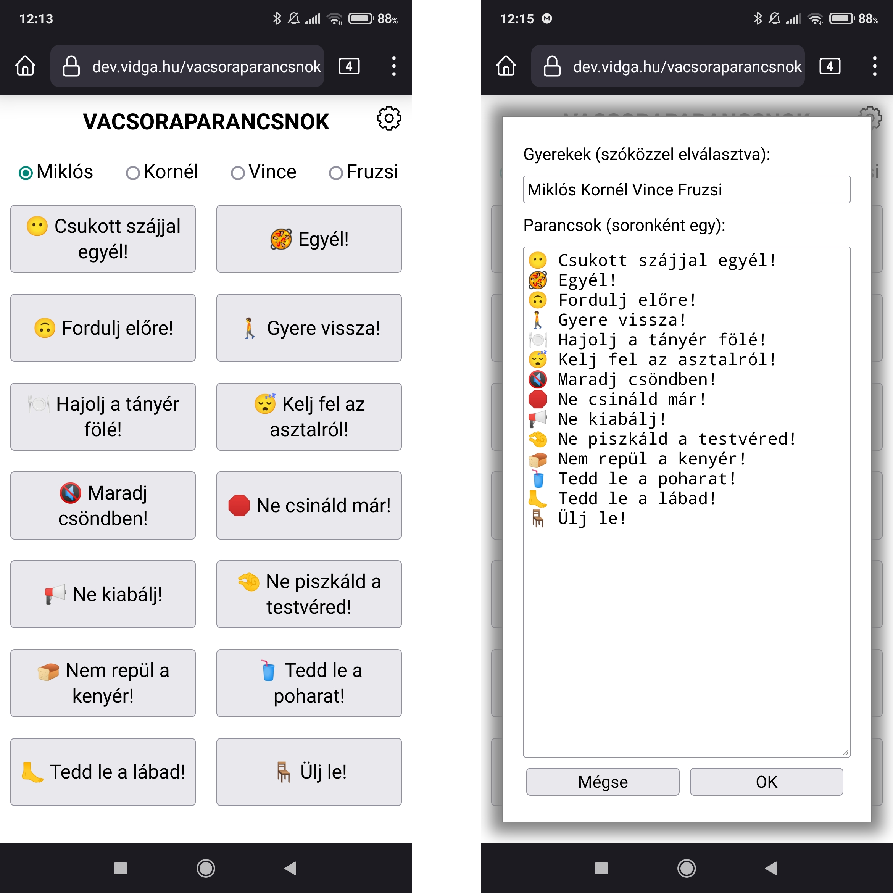

# Vacsoraparancsnok

Eleged lett abból, hogy a gyerekeid vacsora közben nem tudnak viselkedni? Hogy
állandóan ugyanazokért az alapvető dolgokért kell rájuk szólni? Hogy te is
elveszted a türelmed, és ingerültté válsz?

Nem kell tovább aggódnod, a [Vacsoraparancsnok][] megérkezett! Csak nyisd meg ezt a
kis HTML applikációt a kedvenc mobilos böngésződben, csatlakoztasd egy
bluetooth-os kihangosítóra, válaszd ki a renitens gyermek nevét, majd nyomd meg
a helyzetnek megfelelő helyreutasító gombot, és hallgasd elégedetten, hogy a
telefonod beszédszintetizátora rendre inti a gyerekedet, miközben nem emeli fel
a hangját, nem veszti el a türelmét, nem jön ki a sodrából. Te meg falatozhatsz
tovább nyugodtan.

Az sem baj, ha a te gyerekeidet másképp hívják, vagy más dolgok miatt kell rájuk
szólni: a 2.0-ás változatban már arra is lehetőséged van, hogy magából az
alkalmazásból beállítsd a neveket és a helyreutasítások szövegét. A
beállításaidat az oldal sütikben tárolja, így a legközelebbi betöltéskor is
megmaradnak.

A [Vacsoraparancsnok][] megmenti az estéd! 😍🥐

[Vacsoraparancsnok]: https://dhanak.github.io/vacsoraparancsnok
